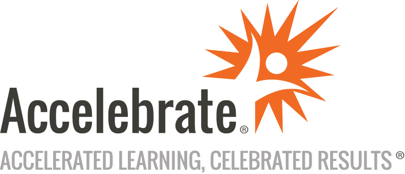

# JavaScript Tips and Tricks Live Coding Events

This series is sponsored by Accelebrate:

To view the archived videos and sign up for notifications of new live sessions visit here: [https://www.t4d.io/live-programming-events](https://www.t4d.io/live-programming-events)

## Episode 1

Eric discussed coding JavaScript from a declarative and semantic perspective. Writing code from declarative and semantic perspective results in code which is easier to understand and maintain. Its one of the more important aspects of JavaScript coding which Eric covers in his live classes.